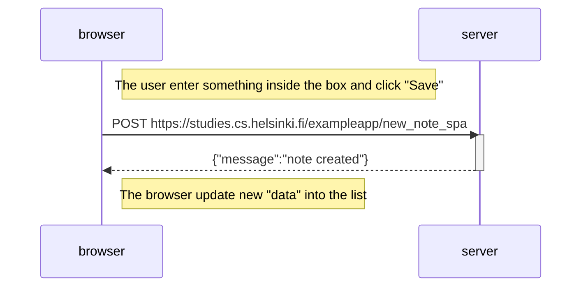

# Exercise 0.6

```mermaid
sequenceDiagram
    participant browser
    participant server

    Note right of browser: The user enter something inside the box and click "Save"

    browser->>server: POST https://studies.cs.helsinki.fi/exampleapp/new_note_spa
    activate server
    server-->>browser: {"message":"note created"}
    deactivate server

    Note right of browser: The browser update new "data" into the list
```
